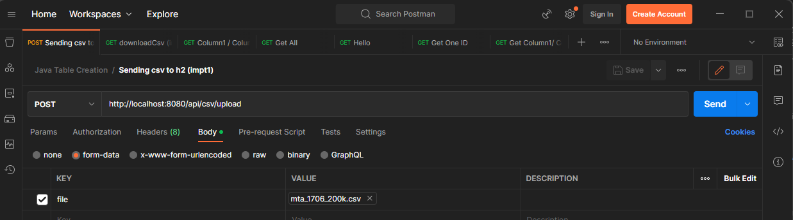

# SpringBoot_NYBusData
## Project Description
<!-- What your application does, Why you used the technologies you used, Some of the challenges you faced and features you hope to implement in the future. -->

This project aims to automate the daily task of removing duplicates from a dataset by providing a Java-based API built with Spring Boot. The application is designed to intake a CSV file and store it in an H2 in-memory database, enabling users to view specific variables (columns) from the uploaded data.

The primary goal of this project is to provide a seamless and efficient solution for removing duplicates from the dataset without requiring users to maintain any data online. The use of the H2 in-memory database ensures that data is stored temporarily and removed upon completion of the operation.

The dataset used in this project is from Kaggle and is real-life, New York City bus data. Each file contains six million rows of raw data, making it troublesome to go through manually. The API provided in this project streamlines the process of managing and manipulating the data, allowing users to focus on their analysis and research.

The Spring Boot framework used in this application provides rapid development, code maintainability, and scalability. The API's source code is open-source, allowing users to modify and extend the application's functionality to meet their specific needs.

In summary, this project provides a user-friendly solution for managing large datasets and removing duplicates without maintaining data online. The project's use of H2 in-memory database and Spring Boot framework ensures efficiency, scalability, and maintainability, making it an ideal solution for data analysis and research.

<details>
  <summary><strong>Table of Contents</strong></summary>
  <ol>
    <li>
      <a href="#project-description">Project Description</a>
      <!-- <ul>
        <li><a href="#built-with">Built With</a></li>
      </ul> -->
    </li>
    <li>
      <a href="#getting-started">Getting Started</a>
      <!-- How to install and run the project -->
     <!-- <ul>
        <li><a href="#prerequisites">Prerequisites</a></li>
        <li><a href="#installation">Installation</a></li>
      </ul> -->
    </li>
    <li><a href="#executing-the-program">Executing the program</a></li>
    <!-- How to use the project -->
    <li><a href="#license">License</a></li>
    <li><a href="#contact-me">Contact Me</a></li>
    <li><a href="#credits">Credits</a></li>
    <li><a href="#test-example">Test example</a></li>
  </ol>
</details>

## Getting Started
<!-- Provide a step-by-step description of how to get the development environment set and running. -->
<!-- Example of how to add picture, by changing the link or downloading the image  and add into the base file.-->
<!--  -->
1. Download the New York City bus dataset from the following website: [Here](https://www.kaggle.com/datasets/stoney71/new-york-city-transport-statistics)

2. Clone or download this repository to your local machine.

3. Open the project in an IDE such as Eclipse or IntelliJ or Visual Studio Code.

4. In the "application.properties" file, ensure that the following configuration properties are set as required: (do not modify this if you are not familiar with the application.properties file)
```Java
- server.port=<port_number>
- spring.datasource.url=jdbc:h2:mem:<database_name>
```
Note: The first property sets the port number that the application will run on. The second property sets the URL for the H2 in-memory database. If you are not familiar with the application.properties file, it is recommended that you do not modify this section.

5. Build the project using the following command in your terminal or command prompt: (only need to run this at the start or when you add new dependencies)

  - mvn clean install

6. Run the project using the following command:

  - mvn spring-boot:run

7. Once the application is running, you can access the API at the following URL:

  - http://localhost:8080/h2/

Note: The maximum upload limit for this project is set to 50 MB to lower waiting time and faster testing. If your CSV file exceeds this limit, you can either increase the limit to fit the file size or break down the file size into smaller bites and combine them afterwards.
You can modify the file size by editing the 'application.properties' file 
```Java
- spring.servlet.multipart.max-file-size=50MB
- spring.servlet.multipart.max-request-size=50MB
```


<!--  -->

<p align="right">(<a href="#project-title">back to top</a>)</p>

## Executing the program
<!-- Provide instructions and examples so users/contributors can use the project. This will make it easy for them in case they encounter a problem – they will always have a place to reference what is expected. -->
<!-- Example of how to add code into ReadMe-->
<!-- ```python
kalandra = kalandra_items.loc[kalandra_items['Name']=='House of Mirrors']
``` -->


1. Use an API client such as Postman to send a POST request to the following URL:

- http://localhost:8080/api/csv/upload 


2. In the request body, select the CSV file you want to upload.

3. Send the request.
---


---
4. To download the CSV file with the name "exampleBusData.csv", send a GET request to the following URL:

  - http://localhost:8080/api/csv/downloadCsv

Note: You can modify the CSV file name by editing the 'application.properties' file 
```Java
csv.download.fileName= exampleBusData.csv
```

5. The CSV file will be downloaded to your local machine.

<p align="right">(<a href="#project-title">back to top</a>)</p>

## License

[MIT LICENSE](LICENSE.txt)

Distributed under the MIT License. 

See `https://choosealicense.com/` for more information.
<p align="right">(<a href="#project-title">back to top</a>)</p>

## Contact 

Marcus Kwok - MarcusKwok8853@gmail.com 
<!-- [@your_twitter](https://twitter.com/0olol) -->
Project Link: [https://github.com/0olol/SpringBoot_NYBusData](https://github.com/0olol/SpringBoot_NYBusData)

<p align="right">(<a href="#project-title">back to top</a>)</p>

## Credits

* [BezKoder's Spring Boot: Upload & Read CSV file](https://www.bezkoder.com/spring-boot-upload-csv-file/)
* [BezKoder' Spring Boot: Download CSV file](https://www.bezkoder.com/spring-boot-download-csv-file/)

<p align="right">(<a href="#project-title">back to top</a>)</p>


